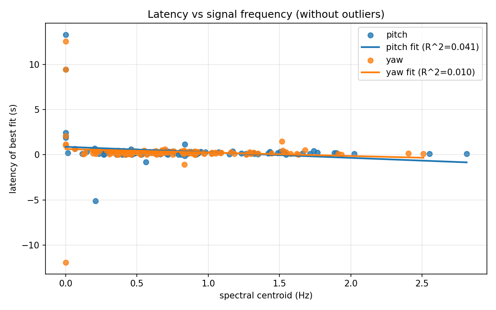
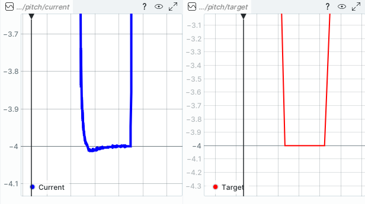
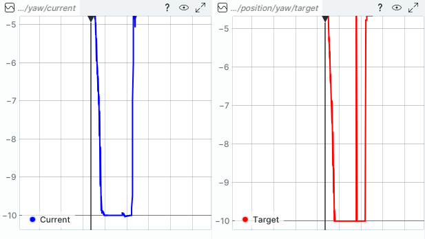
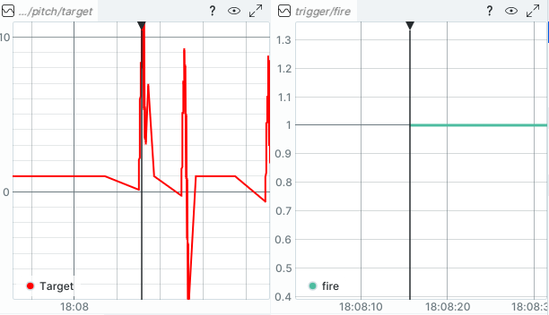
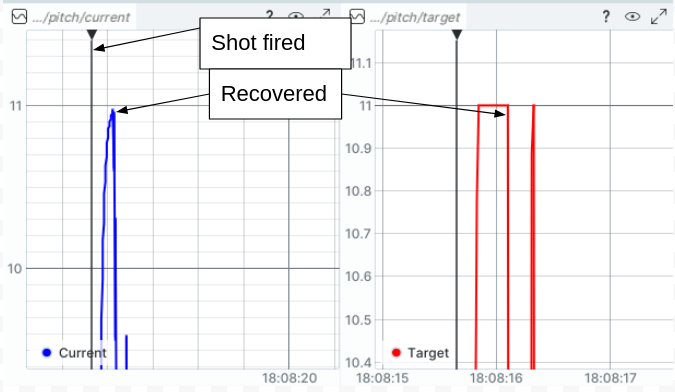
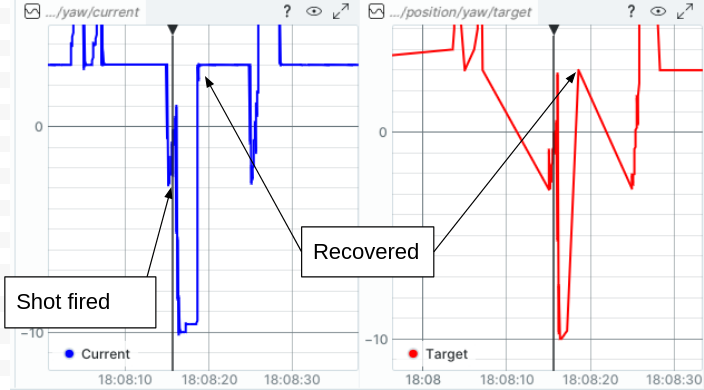
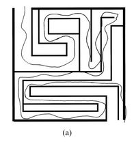

# Results

## Table of Contents

- [Strategy](#strategy)
- [What is the "latency of best fit" for each actuator across the entire dataset?](#what-is-the-latency-of-best-fit-for-each-actuator-across-the-entire-dataset)
- [How does latency vary with movement magnitude?](#how-does-latency-vary-with-movement-magnitude)
- [Pitch vs yaw comparison](#pitch-vs-yaw-comparison)
  - [Overshoot of pitch and yaw](#overshoot-of-pitch-and-yaw)
  - [Settling time of pitch and yaw](#settling-time-of-pitch-and-yaw)
- [Shooting Impact](#shooting-impact)
  - [Actuator deflection when the trigger fires](#actuator-deflection-when-the-trigger-fires)
  - [Is the disturbance primarily in pitch, yaw, or both?](#is-the-disturbance-primarily-in-pitch-yaw-or-both)
  - [How quickly does the system recover to the commanded position?](#how-quickly-does-the-system-recover-to-the-commanded-position)
- [Remaining thoughts](#remaining-thoughts)

### Strategy

I used time series and Fourier analysis to simplify the problem as much as possible.

Python was chosen because it's great for quick data analysis. I tried to follow good Python practices such as `venv`and reusable modules although I usually work with C++. There is a good collection of unit tests and CI, as well.

I didn't filter the data. The noise levels look low already and filtering would introduce latency.

### What is the "latency of best fit" for each actuator across the entire dataset?

For this calculation I used numpy.correlate. It looks at the entire dataset minus a small window around firing (excluded because firing is not normal motion.)

For pitch, the "latency of best fit" was **0.2408 seconds**. For yaw, the "latency of best fit" was **0.2145 seconds**. Very similar.

The script used in this calculation was scripts/bulk_latency_calculation.py.

As a sanity check, here are graphs comparing the two signals for the first 100s.

I can tell from the pitch graph already that **pitch does not track slow position changes well**.

### How does latency vary with movement magnitude?

I used the frequency of the signal as a proxy for "magnitude", because I think the question is really asking about frequency response (slow motions vs fast motions). To grok this, I separated the data into 60-second segments (again, excluding a small window around firing because it's not normal motion). Then I calculated the spectral centroid of target position for each segment and the "latency of best fit." For latency of best fit, again, I used numpy.centroid. Thus I could plot latency vs signal frequency and check if it's linear.

This was implemented in scripts/latency_vs_signal_frequency.py.

The raw plot of latency vs signal centroid frequency is pretty noisy and has a lot of outliers, so it didn't tell me much initially. Here it is:

Attempting to make better sense of the data, I removed outliers beyond 1.5 standard deviations. From eye-balling the graph, the latency is actually worse at lower signal frequencies. Your PID controllers do not track well at low frequencies, as already mentioned before. They seem to be tuned more for high-frequency response, i.e. tuned for better disturbance rejection I suppose.

I added lines of best fit just because your questions asked if the trend is linear, but it's clear from a quick glance that it's not. Latency is much worse for low-frequency data. Latency is low and relatively constant for high-frequency tracking. The R^2 values of the linear trend lines are very low, less than 0.1.

If it's important for your application, you could improve low-frequency tracking by:

- Adding some integral gain
- Switching to velocity control
- Using a model of the system to calculate feedforwad torque

### Pitch vs yaw comparison

I've already mentioned, pitch and yaw had similar latencies across the dataset as a whole (0.2408 seconds for pitch vs 0.2145 seconds for yaw). The latency is a little larger for pitch and I can see from the plot below that the latency for pitch is almost always a positive value (i.e. it almost always lags). Probably this comes from fighting against gravity, which yaw doesn't need to deal with.

#### Overshoot of pitch and yaw

To analyze overshoot, I shifted the `current` signal backward to align with the `target` signal. It was shifted by the same latency I had calculated with numpy.correlate previously. This is important, otherwise latency counts as settling time. Again, I intentionally skipped a short window around firing because that's not normal motion.

Then I used a function to identify individual signal reversal events and calculated overshoot for each one. Signal reversal was detected by checking the sign of the slope estimate, where slope was estimated from smoothed first differences. The smoothing was a simple moving average. (A Butterworth low-pass filter would be better).

Finally, for simplicity, I only kept reversal events which were similar to a step, i.e. followed by a plateau. With this simplification, it was easy to report overshoot as a percentage.

I visually spot-checked the overshoot events detected by the script against the Rerun plots and tuned the algorithm to reduce false positives. It could use some more tuning if I had more time. This type of algorithm is finicky.

This overshoot analysis was performed in scripts/overshoot_and_settling.py.

For yaw, average overshoot was **1.43%** and there were 35 overshoot events greater than 10%.

For pitch, average overshoot was **-7.80%**. There were 9 overshoot events greater than 10%. The negative sign means, pitch undershot more often than it overshot.

The results indicate that pitch may be tuned less aggressively than yaw. Likely there is more inertia about pitch, so it takes more energy to move. Finally, gravity may have been fighting against pitch whereas yaw does not have that issue. The gravity and other dynamic effects could be counteracted by running a dynamic model in the background and providing feedforward torques to the actuators. I've used the Drake simulator to great success with such things in the past.

#### Settling time of pitch and yaw

I attempted to solve for settling time in an automated way but the results were awful. Instead, I searched the Rerun graphs manually.

For pitch, the previous section showed that it rarely overshoots. In fact, even when I find a command signal which looks similar to an ideal step, the overshoot is negligible. For example, here at 18:06:55.135, there's a command which is very similar to an ideal step but the overshoot is much less than 1%. Thus, settling time for the pitch joint is **N/A**.

Pitch step response (negligible overshoot)

For yaw, the situation is similar. It rarely overshoots, thus the settling time is **N/A**. Here's an instance at 18:43:24.36 where the target signal is nearly an ideal step but yaw does not overshoot at all.

Yaw step response (negligible overshoot)

### Shooting Impact

In regards to shooting, note that the Rerun signals aren't perfectly synchronized. During firing, the /pitch/target plot jumps prior to trigger/fire going high, for instance.

A small synchronization discrepancy between trigger and the beginning of pitch motion

It's difficult to tell but I'll assume the periods indicated below are when each joint recovered from the shot.

My assumed recovery period for pitch

My assumed recovery period for yaw

#### Actuator deflection when the trigger fires

Measuring from the plots shown above:

Pitch deflects approximately **1.07 rad**.
Yaw deflects approximately **1.76 rad**.

#### Is the disturbance primarily in pitch, yaw, or both?

Yaw deflects about 64% more than pitch but it's a large deflection for both axes.

#### How quickly does the system recover to the commanded position?

Pitch recovers in approximately **0.48s**, yaw recovers in approximately **3.02s**.

### Remaining thoughts

These are a few scattered thoughts that may help the project.

#### CAN vs ethercat

Ethercat is the obvious choice.

#### Mechanical design to reduce recoil

If you could mount both actuators in line with the barrel, that would reduce recoil.

#### Choice of actuator

Harmonic drives are generally more accurate and harder to backdrive than single-stage planetary geartrains. A harmonic drive would likely be preferred for this application. There are other actuator types to consider, as well, which I don't know so much about.

#### Position vs velocity control

In the robotics world, it's been known for decades that the choice of velocity control or position control has a large effect on how the robot behaves. For example, Duchaine (2007) showed that a robot can be guided through a maze 18% faster if velocity control is used.

A robotic maze experiment where velocity control outperformed position control

Velocity control is generally chosen for faster tracking or smoother output. Position control is generally chosen for a more accurate final position. You need both accuracy and speed so it might be hard to choose.

#### Actuator brakes

I believe it takes a few hundred milliseconds for actuator brakes to activate. You could engage the brakes before the turret fires to ensure it's completely stable.

#### Smith predictor

In control theory, there's a concept called a Smith predictor. For linear systems with fixed latency, you can implement a Smith predictor to completely counteract the affects of latency.

You can do something similar for nonlinear systems by predicting the state of the system forward, but it's not as elegant or perfect as far as I know.
