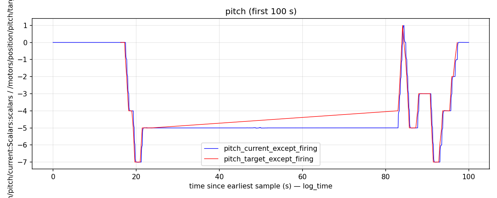
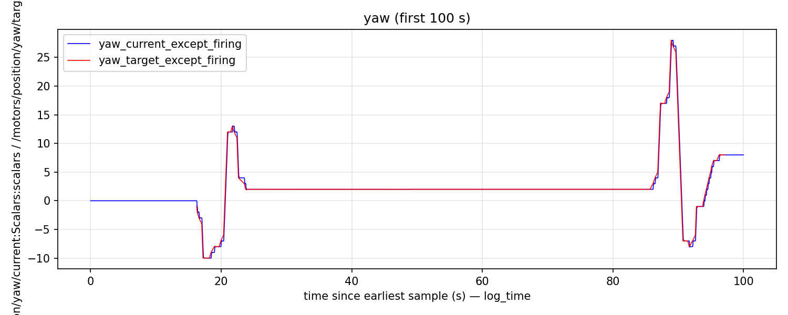
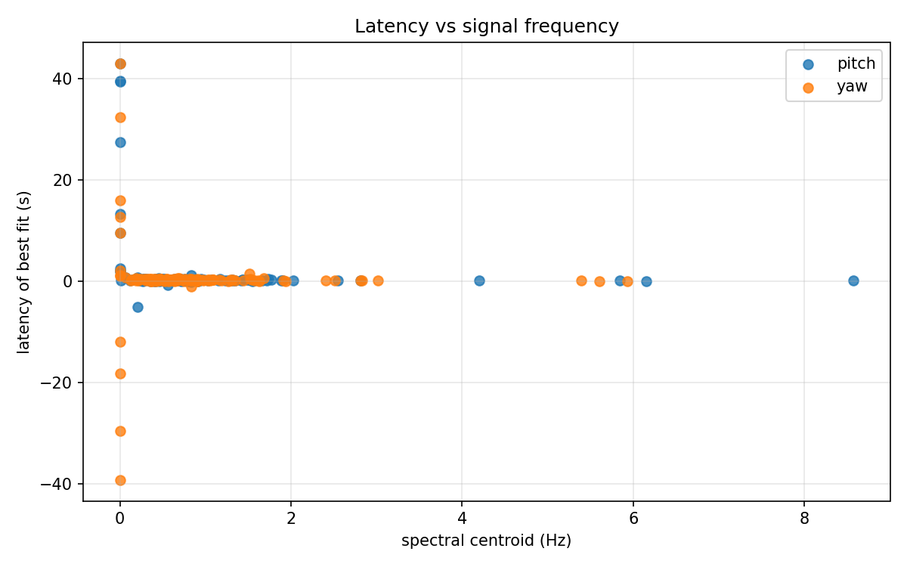

### What is the "latency of best fit" for each actuator across the entire dataset?

For this calculation I used numpy.correlate. It looks at the entire dataset minus a small window around firing (excluded because firing is not normal motion.)

For pitch, the "latency of best fit" was **0.2408 seconds**. For yaw, the "latency of best fit" was **0.2145 seconds**. Very similar.

The script used in this calculation was scripts/bulk_latency_calculation.py.

As a sanity check, here are graphs comparing the two signals for the first 100s.

I can tell from the pitch graph already that **pitch does not track slow position changes well**.

### How does latency vary with movement magnitude?

I used the frequency of the signal as a proxy for "magnitude", because I think the question is really asking about frequency response (slow motions vs fast motions). To grok this, I separated the data into 60-second segments (again, excluding a small window around firing because it's not normal motion). Then I calculated the spectral centroid of each segment and the "latency of best fit." Thus I could plot latency vs signal frequency and check if it's linear.

This was implemented in scripts/latency_vs_signal_frequency.py.

The raw plot of latency vs signal centroid frequency is pretty noisy and has a lot of outliers, so it doesn't tell me much. Here it is:

